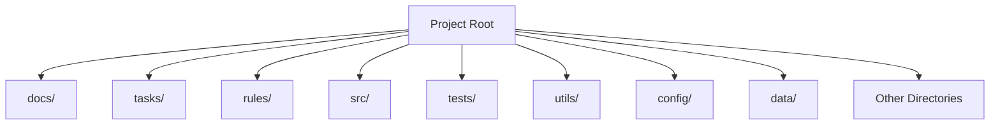

<!--
description: directory structure to follow
-->

# Directory Structure

```mermaid
flowchart TD
    Root[Project Root]
    Root --> Docs[docs/]
    Root --> Tasks[tasks/]
    Root --> Rules[rules/]
    Root --> SourceCode[src/]
    Root --> Test[tests/]
    Root --> Utils[utils/]
    Root --> Config[config/]
    Root --> Data[data/]
    Root --> Other[Other Directories]
```
