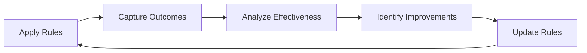

# Self-Updating Rules System

## Overview
This system enables the rules to evolve based on project needs and learning outcomes, implementing an adaptive framework approach.

## Self-Update Mechanisms

### 1. Pattern Recognition Updates
When new successful patterns emerge during development:

```
Pattern Discovery → Validation → Documentation → Rule Integration → Testing
```

**Trigger Conditions:**
- Repeated successful implementation approaches
- New architectural insights from sessions
- Performance optimizations that work consistently
- Error prevention techniques that prove effective

**Update Process:**
1. Identify pattern from WORKING_LOG/ analysis
2. Validate pattern effectiveness across multiple uses
3. Document in rules/lessons-learned.md
4. Integrate into relevant protocol tokens
5. Test updated protocols in next session

### 2. Error-Driven Rule Evolution
When error patterns are resolved and documented:

```
Error Resolution → Root Cause Analysis → Prevention Strategy → Rule Update
```

**Update Process:**
1. Document error and resolution in rules/error-documentation.md
2. Analyze if existing rules could have prevented the error
3. Update relevant protocols (e.g., @PRE_IMPL, @SIM_TEST)
4. Add prevention checks to appropriate token workflows

### 3. Context-Driven Adaptation
Rules adapt based on project evolution and context changes:

**Adaptation Triggers:**
- New technology integration requiring updated protocols
- Scale changes (e.g., microservice → distributed system)
- Team workflow changes affecting development patterns
- Performance requirements driving new optimization rules

### 4. Learning Loop Integration
Continuous improvement through structured feedback:



## Update Protocols

### Weekly Pattern Review
Every 7 days or 5+ development sessions:
1. Review WORKING_LOG/ entries for pattern emergence
2. Identify successful approaches used multiple times
3. Extract generalizable principles
4. Update relevant rules files

### Monthly Architecture Review
Every month or major milestone:
1. Assess if architectural changes require rule updates
2. Review token effectiveness based on session outcomes
3. Update protocol workflows based on usage patterns
4. Refresh anti-patterns based on avoided mistakes

### On-Demand Rule Updates
Immediate updates when:
- Critical error prevention discovered
- Major architectural shift requires new protocols
- User feedback indicates rule inadequacy
- New technology integration needs protocol support

## Self-Documentation System

### Rule Effectiveness Tracking
Each rule includes effectiveness metrics:
- **Usage Frequency**: How often rule is applied
- **Success Rate**: Percentage of successful applications
- **Error Prevention**: Number of errors avoided
- **Time Efficiency**: Impact on development speed

### Version Control for Rules
Rules maintain version history:
- **Change Log**: What changed and why
- **Rationale**: Business/technical justification
- **Impact Assessment**: Effect on development workflow
- **Rollback Triggers**: Conditions for reverting changes

### Cross-Rule Dependencies
Document relationships between rules:
- **Prerequisite Rules**: Must be applied before this rule
- **Complementary Rules**: Work best when used together
- **Conflicting Rules**: Cannot be applied simultaneously
- **Override Conditions**: When this rule takes precedence

## Implementation Guidelines

### Update Validation
Before implementing rule changes:
1. **Impact Analysis**: How will this affect existing workflows?
2. **Backward Compatibility**: Will existing projects still work?
3. **Test Cases**: How can we validate the new rule works?
4. **Rollback Plan**: How do we revert if the change fails?

### Change Communication
When rules are updated:
1. Document change in WORKING_LOG/ session entry
2. Update affected protocol tokens
3. Note change in next active_context.md update
4. Test updated protocols in controlled scenarios

### Learning Integration
New learning gets integrated through:
1. **Session Insights** → WORKING_LOG/ → Pattern extraction
2. **Error Resolutions** → error-documentation.md → Prevention rules
3. **Architecture Changes** → docs/architecture.md → Protocol updates
4. **User Feedback** → Direct rule modifications → Effectiveness tracking

## Core Philosophy

### System Customization
- Rules adapt to project-specific needs
- Generic patterns customize to specific contexts
- User preferences influence rule evolution
- Project constraints shape protocol modifications

### Adaptive Evolution
- Rules are not static but evolutionary
- System learns from successes and failures
- Feedback loops drive continuous improvement
- Context awareness guides adaptation

### Living System Maintenance
- Rules maintain themselves through usage patterns
- System evolves without manual intervention
- Learning compounds through structured feedback
- Context preservation enables intelligent adaptation

---
*"The system should learn and adapt based on usage patterns, not remain static."*